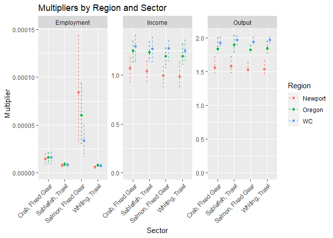

---
output:
  md_document:
    variant: markdown_github
---

```{r setup, include=FALSE}
knitr::opts_chunk$set(fig.path = "man/figures/README-", echo = TRUE,
  warning = FALSE, message = FALSE)
```

<!-- README.md is generated from README.Rmd. Please edit that file -->

# IOPAC

This is a repository containing the Input-Output model for Pacific Coast Fisheries (IOPAC), created by [Jerry Leonard](https://github.com/allen-chen-noaa-gov/IOPAC_pub/blob/main/inst/leonard_TM.pdf). This model estimates gross changes in economic contributions due to changes in fishery harvests, for example from environmental or policy changes. This readme documents the repository and provides a minimal reproducible example.

## Data submodule
Note that the data folder is in a private repository. Please contact allen.chen@noaa.gov for permissions. To push and pull from the data submodule, you can first work inside data submodule:
```{git, eval=FALSE}
cd data
# make changes, add, commit, push
git add .
git commit -m "Your message for data submodule"
git push
```
Then update the submodule reference in your main repo:
```{git, eval=FALSE}
cd ..
git add data
git commit -m "Update data submodule reference"
git push
```

## Running the model

Running the model can be done through the high-level wrapper function 
`iopac_wrap`. Installing the package requires `devtools`.

```{r, eval=FALSE}
library(devtools)
library(here)
here()
#The working directory should be the top level of the package.
install("IOPAC")
```

The wrapper function calls on eleven total inputs, two of which are optional. The output is a (n*m) by 12 data frame, where the first three columns correspond to the geographic region, sector, and name of sector for a multiplier, where there are _n_ regions and _m_ sectors. Then, the remaining 9 columns correspond to the output, income, and employment multipliers for vessels, processors, and their aggregate (total), for each region-sector. A missing value denotes that there is an absence of data (e.g. fish tickets) for that region-sector.

```{r, eval=TRUE}
library(IOPAC)
library(ggplot2)

costflist_2023 <- costflist_template

costflist_2023$vessel <- clean_cost_data()

costflist_2023$processor <- clean_cost_data(sums = costf_P_list[["y2023"]],
  type = "processor")

multres <- iopac_wrap(costfin = costflist_2023)
head(multres)
```

There is also a bounds function, depicting the central tendency and uncertainty of the multipliers. The bounds are calculated using the 2.5th, 50th, and 97.5th percentiles of the multipliers, which can be used to visualize bounds for the multipliers. An example for specific regions and sectors is shown below.

```{r, eval=FALSE}
multbounds <- make_mult_bounds()
plotres <- multbounds[multbounds$Region %in% c("WC", "Oregon",
  "Newport"), ]
plotres <- plotres[plotres$Name %in% c("Whiting, Trawl",
  "Sablefish, Trawl", "Crab, Fixed Gear", "Salmon, Fixed Gear"), ]

cols_to_check <- c("Perc_025", "Perc_500", "Perc_975")

plotres <- plotres[rowSums(plotres[, cols_to_check] == 0) == 0, ]

ggplot(plotres, aes(x = Name, y = Perc_500, color = Region)) +
  geom_point(position=position_dodge(width=0.5)) +
  geom_errorbar(aes(ymin = Perc_025, ymax = Perc_975), width = 0.2,
    linetype = "dashed", position=position_dodge(width=0.5)) +
  facet_wrap(~MultType, scales = "free") +
  scale_y_continuous(limits = c(0, NA)) +
  labs(title = "Multipliers by Region and Sector",
    x = "Sector",
    y = "Multiplier") +
  theme(axis.text.x = element_text(angle = 45, hjust = 1)) 
```



The wrapper function creates multipliers for the vessel and processor through the functions `make_v_mults` and `make_p_mults` respectively. These can be used to create individual multipliers instead if desired. Documentation for all functions can be found by typing ?function, for example:

```{r, eval=FALSE}
?iopac_wrap
```

Therefore, `make_v_mults` and `make_p_mults` create the multipliers, while `iopac_wrap` passes the relevant data to the functions.

The package also includes a number of data sets that can produce multipliers for the West Coast region, and documentation for all included data can also be found similarily (typing ?data). The default data used are the most most recent, but the years 2017 through 2023 are included for cost, markup, and fish ticket data where available.

```{r, eval=FALSE}
?prodflow
```

Therefore the user can create multipliers calibrating the model with costs or catches from different years, or use their own data if desired, as long as the data matches the same format. For example, calibrating the model with cost, fish ticket, and processor markup data from 2017 below.

```{r, eval=TRUE}
costflist_2017 <- costflist_template
costflist_2017$vessel <- clean_cost_data()
costflist_2017$processor <- clean_cost_data(sums = costf_P_list[["y2017"]],
  type = "processor")

multres <- iopac_wrap(costfin = costflist_2017, ticsin = tics_list$y2017,
	markupsin = markups_list$y2017)

subset(multres, Region == 'WC' & Name == 'Whiting, Trawl')$Processor_income
```

## Recreational multipliers

Recreational multipliers can now also be called within the package. Note that while the commercial multipliers are contributions per dollar of catch revenue, the recreational multipliers are dollars per trip.

```{r, eval=TRUE}
make_rec()
```