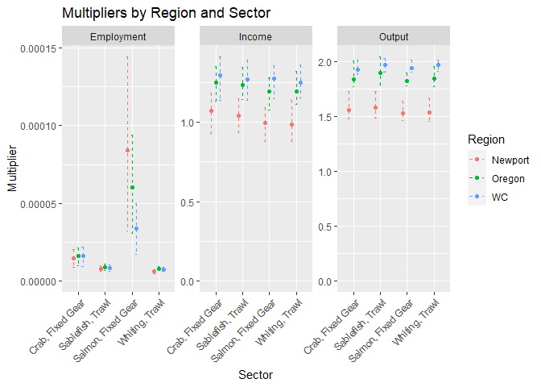

<!-- README.md is generated from README.Rmd. Please edit that file -->

# IOPAC

This is a repository containing the Input-Output model for Pacific Coast
Fisheries (IOPAC), created by [Jerry
Leonard](https://github.com/allen-chen-noaa-gov/IOPAC_pub/blob/main/inst/leonard_TM.pdf).
This model estimates gross changes in economic contributions due to
changes in fishery harvests, for example from environmental or policy
changes. This readme documents the repository and provides a minimal
reproducible example.

## Data submodule

Note that the data folder is in a private repository. Please contact
<allen.chen@noaa.gov> for permissions. To push and pull from the data
submodule, you can first work inside data submodule:

``` git
cd data # nolint: error.
# make changes, add, commit, push
git add .
git commit -m "Your message for data submodule"
git push
```

Then update the submodule reference in your main repo:

``` git
cd ..
git add data
git commit -m "Update data submodule reference"
git push
```

## Running the model

Running the model can be done through the high-level wrapper function
`iopac_wrap`. Installing the package requires `devtools`.

``` r
library(devtools)
library(here)
here()
#The working directory should be the top level of the package. Go up one to install.
install(here("..", "IOPAC_pub"))
```

The wrapper function calls on eleven total inputs, two of which are
optional. The output is a (n\*m) by 12 data frame, where the first three
columns correspond to the geographic region, sector, and name of sector
for a multiplier, where there are *n* regions and *m* sectors. Then, the
remaining 9 columns correspond to the output, income, and employment
multipliers for vessels, processors, and their aggregate (total), for
each region-sector. A missing value denotes that there is an absence of
data (e.g. fish tickets) for that region-sector.

``` r
#Note package name is IOPAC
library(IOPAC)
library(ggplot2)

costflist_2023 <- costflist_template

costflist_2023$vessel <- clean_cost_data(functype = "vessel")

costflist_2023$processor <- clean_cost_data(sums = costf_P_list[["y2023"]],
  functype = "processor")

multres <- iopac_wrap(costfin = costflist_2023)
head(multres)
```

    ##    Region                    Name Sector Vessel_output Vessel_income
    ## 1 Astoria         Whiting, At Sea    529      0.000000     0.0000000
    ## 2 Astoria          Whiting, Trawl    530      1.669010     0.8102007
    ## 3 Astoria     Whiting, Fixed Gear    531      0.000000     0.0000000
    ## 4 Astoria        Sablefish, Trawl    532      1.703540     0.8918385
    ## 5 Astoria   Sablefish, Fixed Gear    533      1.735935     0.8651723
    ## 6 Astoria Dover/Thornyhead, Trawl    534      1.705272     0.8982394
    ##   Vessel_employment Processor_output Processor_income Processor_employment
    ## 1      0.000000e+00         0.000000        0.0000000         0.000000e+00
    ## 2      7.367387e-06         4.355045        1.2202148         1.563905e-05
    ## 3      0.000000e+00         0.000000        0.0000000         0.000000e+00
    ## 4      8.396986e-06         1.736018        0.4864047         6.234073e-06
    ## 5      2.140190e-05         1.736018        0.4864047         6.234073e-06
    ## 6      8.491922e-06         1.850036        0.5183508         6.643515e-06
    ##     TotOut   TotInc       TotEmp
    ## 1 0.000000 0.000000 0.000000e+00
    ## 2 6.024055 2.030415 2.300644e-05
    ## 3 0.000000 0.000000 0.000000e+00
    ## 4 3.439558 1.378243 1.463106e-05
    ## 5 3.471953 1.351577 2.763597e-05
    ## 6 3.555308 1.416590 1.513544e-05

There is also a bounds function, depicting the central tendency and
uncertainty of the multipliers. The bounds are calculated using the
2.5th, 50th, and 97.5th percentiles of the multipliers, which can be
used to visualize bounds for the multipliers. An example for specific
regions and sectors is shown below.

``` r
multbounds <- make_mult_bounds()
plotres <- multbounds[multbounds$Region %in% c("WC", "Oregon",
  "Newport"), ]
plotres <- plotres[plotres$Name %in% c("Whiting, Trawl",
  "Sablefish, Trawl", "Crab, Fixed Gear", "Salmon, Fixed Gear"), ]

cols_to_check <- c("Perc_025", "Perc_500", "Perc_975")

plotres <- plotres[rowSums(plotres[, cols_to_check] == 0) == 0, ]

ggplot(plotres, aes(x = Name, y = Perc_500, color = Region)) +
  geom_point(position=position_dodge(width=0.5)) +
  geom_errorbar(aes(ymin = Perc_025, ymax = Perc_975), width = 0.2,
    linetype = "dashed", position=position_dodge(width=0.5)) +
  facet_wrap(~MultType, scales = "free") +
  scale_y_continuous(limits = c(0, NA)) +
  labs(title = "Multipliers by Region and Sector",
    x = "Sector",
    y = "Multiplier") +
  theme(axis.text.x = element_text(angle = 45, hjust = 1)) 
```



The wrapper function creates multipliers for the vessel and processor
through the functions `make_v_mults` and `make_p_mults` respectively.
These can be used to create individual multipliers instead if desired.
Documentation for all functions can be found by typing ?function, for
example:

``` r
?iopac_wrap
```

Therefore, `make_v_mults` and `make_p_mults` create the multipliers,
while `iopac_wrap` passes the relevant data to the functions.

The individual `make_v_cat_mults` and `make_p_cat_mults` functions can
also be used to create commodity-level multipliers for vessels and
processors respectively, which can be used to understand the
contributions of specific commodities to the overall multipliers:

``` r
catsv <- make_v_cat_mults(impbridge = impbridgelist,
  costf = costflist_2023,
  mults = mults,
  type = "Output",
  sector = "Oregon",
  ticsin = tics_list$y2023,
  ecpi = ecpi,
  taxes = taxes,
  comnamesin = comnames,
  output = NULL,
  zeroprop = TRUE,
  zeropropdir = FALSE)
head(catsv)
```

    ##                                 3002         3003         3004         3005
    ## Whiting, At Sea                   NA           NA           NA           NA
    ## Whiting, Trawl          2.302501e-06 7.564304e-05 8.220881e-05 9.213691e-05
    ## Whiting, Fixed Gear               NA           NA           NA           NA
    ## Sablefish, Trawl        2.391489e-06 7.856653e-05 8.538605e-05 9.569786e-05
    ## Sablefish, Fixed Gear   4.798651e-06 1.576479e-04 1.713317e-04 1.920229e-04
    ## Dover/Thornyhead, Trawl 2.405043e-06 7.901181e-05 8.586999e-05 9.624024e-05
    ##                                 3006 3008         3009         3010
    ## Whiting, At Sea                   NA   NA           NA           NA
    ## Whiting, Trawl          7.914790e-06    0 3.550592e-08 3.543788e-07
    ## Whiting, Fixed Gear               NA   NA           NA           NA
    ## Sablefish, Trawl        8.220685e-06    0 3.687817e-08 3.680750e-07
    ## Sablefish, Fixed Gear   1.649524e-05    0 7.399802e-08 7.385622e-07
    ## Dover/Thornyhead, Trawl 8.267276e-06    0 3.708718e-08 3.701612e-07
    ##                                 3013         3014        3017         3018
    ## Whiting, At Sea                   NA           NA          NA           NA
    ## Whiting, Trawl          2.803015e-05 3.318065e-07 0.005156263 1.237092e-05
    ## Whiting, Fixed Gear               NA           NA          NA           NA
    ## Sablefish, Trawl        2.911347e-05 3.446303e-07 0.013894219 1.284904e-05
    ## Sablefish, Fixed Gear   5.841773e-05 6.915192e-07 0.092515434 2.578229e-05
    ## Dover/Thornyhead, Trawl 2.927847e-05 3.465836e-07 0.014534618 1.292186e-05
    ##                                 3026         3027         3028         3029
    ## Whiting, At Sea                   NA           NA           NA           NA
    ## Whiting, Trawl          4.462281e-10 1.413854e-07 9.964632e-08 1.978974e-07
    ## Whiting, Fixed Gear               NA           NA           NA           NA
    ## Sablefish, Trawl        4.634741e-10 1.468497e-07 1.034975e-07 2.055458e-07
    ## Sablefish, Fixed Gear   9.299855e-10 2.946617e-07 2.076733e-07 4.124387e-07
    ## Dover/Thornyhead, Trawl 4.661009e-10 1.476820e-07 1.040841e-07 2.067108e-07
    ##                                 3055         3060         3061         3062
    ## Whiting, At Sea                   NA           NA           NA           NA
    ## Whiting, Trawl          8.544897e-05 4.390836e-05 1.297491e-07 3.913653e-07
    ## Whiting, Fixed Gear               NA           NA           NA           NA
    ## Sablefish, Trawl        7.766640e-05 4.560535e-05 1.347637e-07 4.064910e-07
    ## Sablefish, Fixed Gear   1.264964e-04 9.150956e-05 2.704105e-07 8.156458e-07
    ## Dover/Thornyhead, Trawl 7.758054e-05 4.586382e-05 1.355274e-07 4.087948e-07
    ##                                 3063         3064         3065         3066
    ## Whiting, At Sea                   NA           NA           NA           NA
    ## Whiting, Trawl          3.187797e-07 3.195085e-07 1.374393e-06 2.472582e-05
    ## Whiting, Fixed Gear               NA           NA           NA           NA
    ## Sablefish, Trawl        3.311000e-07 3.318570e-07 1.427511e-06 2.568143e-05
    ## Sablefish, Fixed Gear   6.643699e-07 6.658888e-07 2.864377e-06 5.153116e-05
    ## Dover/Thornyhead, Trawl 3.329766e-07 3.337378e-07 1.435602e-06 2.582698e-05
    ##                                 3067         3068         3069         3070
    ## Whiting, At Sea                   NA           NA           NA           NA
    ## Whiting, Trawl          2.914377e-06 5.606927e-07 1.726597e-05 6.624818e-06
    ## Whiting, Fixed Gear               NA           NA           NA           NA
    ## Sablefish, Trawl        3.027013e-06 5.823626e-07 1.793328e-05 6.880857e-06
    ## Sablefish, Fixed Gear   6.073864e-06 1.168542e-06 3.598408e-05 1.380681e-05
    ## Dover/Thornyhead, Trawl 3.044169e-06 5.856632e-07 1.803492e-05 6.919855e-06
    ##                                 3071         3072         3073         3074
    ## Whiting, At Sea                   NA           NA           NA           NA
    ## Whiting, Trawl          1.408049e-05 0.0001851132 0.0001193718 2.011251e-05
    ## Whiting, Fixed Gear               NA           NA           NA           NA
    ## Sablefish, Trawl        1.462468e-05 0.0001922676 0.0001239853 2.088983e-05
    ## Sablefish, Fixed Gear   2.934521e-05 0.0003857951 0.0002487832 4.191656e-05
    ## Dover/Thornyhead, Trawl 1.470757e-05 0.0001933573 0.0001246880 2.100823e-05
    ##                                 3075         3076         3077         3078
    ## Whiting, At Sea                   NA           NA           NA           NA
    ## Whiting, Trawl          1.356311e-05 3.391725e-05 1.345106e-05 7.230030e-06
    ## Whiting, Fixed Gear               NA           NA           NA           NA
    ## Sablefish, Trawl        1.408730e-05 3.522810e-05 1.397093e-05 7.509460e-06
    ## Sablefish, Fixed Gear   2.826692e-05 7.068706e-05 2.803341e-05 1.506813e-05
    ## Dover/Thornyhead, Trawl 1.416714e-05 3.542776e-05 1.405011e-05 7.552020e-06
    ##                                 3079         3080         3081         3082
    ## Whiting, At Sea                   NA           NA           NA           NA
    ## Whiting, Trawl          0.0001719100 0.0001837973 1.767269e-05 3.252859e-05
    ## Whiting, Fixed Gear               NA           NA           NA           NA
    ## Sablefish, Trawl        0.0001785540 0.0001909008 1.835571e-05 3.378577e-05
    ## Sablefish, Fixed Gear   0.0003582782 0.0003830526 3.683171e-05 6.779295e-05
    ## Dover/Thornyhead, Trawl 0.0001795660 0.0001919827 1.845974e-05 3.397725e-05
    ##                                 3083         3084         3085         3086
    ## Whiting, At Sea                   NA           NA           NA           NA
    ## Whiting, Trawl          1.522210e-05 5.670843e-05 0.0002095769 1.240788e-05
    ## Whiting, Fixed Gear               NA           NA           NA           NA
    ## Sablefish, Trawl        1.581041e-05 5.890012e-05 0.0002176768 1.288743e-05
    ## Sablefish, Fixed Gear   3.172442e-05 1.181862e-04 0.0004367801 2.585931e-05
    ## Dover/Thornyhead, Trawl 1.590001e-05 5.923395e-05 0.0002189105 1.296047e-05
    ##                                 3087         3088         3089         3090
    ## Whiting, At Sea                   NA           NA           NA           NA
    ## Whiting, Trawl          6.417136e-06 0.0002049061 9.662448e-05 7.573498e-05
    ## Whiting, Fixed Gear               NA           NA           NA           NA
    ## Sablefish, Trawl        6.665149e-06 0.0002128254 1.003589e-04 7.866202e-05
    ## Sablefish, Fixed Gear   1.337398e-05 0.0004270456 2.013754e-04 1.578395e-04
    ## Dover/Thornyhead, Trawl 6.702924e-06 0.0002140316 1.009277e-04 7.910784e-05
    ##                                 3091         3092         3093         3094
    ## Whiting, At Sea                   NA           NA           NA           NA
    ## Whiting, Trawl          0.0002148791 6.758311e-05 0.0002297262 2.081963e-07
    ## Whiting, Fixed Gear               NA           NA           NA           NA
    ## Sablefish, Trawl        0.0002231839 7.019509e-05 0.0002386048 2.162428e-07
    ## Sablefish, Fixed Gear   0.0004478304 1.408502e-04 0.0004787732 4.339027e-07
    ## Dover/Thornyhead, Trawl 0.0002244488 7.059293e-05 0.0002399571 2.174684e-07
    ##                                 3095         3096         3097         3098
    ## Whiting, At Sea                   NA           NA           NA           NA
    ## Whiting, Trawl          8.756423e-08 3.579472e-06 7.690789e-06 3.309146e-05
    ## Whiting, Fixed Gear               NA           NA           NA           NA
    ## Sablefish, Trawl        9.094845e-08 3.717813e-06 7.988026e-06 3.437039e-05
    ## Sablefish, Fixed Gear   1.824929e-07 7.459991e-06 1.602840e-05 6.896603e-05
    ## Dover/Thornyhead, Trawl 9.146391e-08 3.738885e-06 8.033299e-06 3.456519e-05
    ##                                 3099        3100         3108         3116
    ## Whiting, At Sea                   NA          NA           NA           NA
    ## Whiting, Trawl          3.458310e-06 0.004755800 1.715020e-11 2.389389e-06
    ## Whiting, Fixed Gear               NA          NA           NA           NA
    ## Sablefish, Trawl        3.591969e-06 0.006468231 1.781303e-11 2.171767e-06
    ## Sablefish, Fixed Gear   7.207477e-06 0.004282946 3.574279e-11 3.537189e-06
    ## Dover/Thornyhead, Trawl 3.612327e-06 0.006443604 1.791398e-11 2.169366e-06
    ##                                 3130         3138         3139        3146
    ## Whiting, At Sea                   NA           NA           NA          NA
    ## Whiting, Trawl          0.0002614384 1.458755e-09 4.397843e-05 0.003400282
    ## Whiting, Fixed Gear               NA           NA           NA          NA
    ## Sablefish, Trawl        0.0002376269 1.515133e-09 7.060966e-05 0.001784129
    ## Sablefish, Fixed Gear   0.0003870265 3.040196e-09 2.413219e-04 0.001507786
    ## Dover/Thornyhead, Trawl 0.0002373642 1.523720e-09 7.126516e-05 0.001698933
    ##                                 3147         3149         3150         3151
    ## Whiting, At Sea                   NA           NA           NA           NA
    ## Whiting, Trawl          1.372254e-10 6.855547e-06 8.074705e-10 4.133803e-10
    ## Whiting, Fixed Gear               NA           NA           NA           NA
    ## Sablefish, Trawl        1.425290e-10 6.231153e-06 8.386780e-10 4.293568e-10
    ## Sablefish, Fixed Gear   2.859919e-10 1.014877e-05 1.682852e-09 8.615273e-10
    ## Dover/Thornyhead, Trawl 1.433368e-10 6.224265e-06 8.434313e-10 4.317902e-10
    ##                                 3152         3153         3154         3155
    ## Whiting, At Sea                   NA           NA           NA           NA
    ## Whiting, Trawl          3.227927e-08 2.962070e-09 1.193600e-08 7.059936e-09
    ## Whiting, Fixed Gear               NA           NA           NA           NA
    ## Sablefish, Trawl        3.352681e-08 3.076549e-09 1.239731e-08 7.332792e-09
    ## Sablefish, Fixed Gear   6.727333e-08 6.173260e-09 2.487587e-08 1.471364e-08
    ## Dover/Thornyhead, Trawl 3.371683e-08 3.093986e-09 1.246757e-08 7.374351e-09
    ##                                 3156         3157         3158         3159
    ## Whiting, At Sea                   NA           NA           NA           NA
    ## Whiting, Trawl          7.400487e-10 3.043218e-10 5.038764e-13 1.898902e-09
    ## Whiting, Fixed Gear               NA           NA           NA           NA
    ## Sablefish, Trawl        7.686505e-10 3.160834e-10 5.233505e-13 1.972292e-09
    ## Sablefish, Fixed Gear   1.542338e-09 6.342382e-10 1.050131e-12 3.957509e-09
    ## Dover/Thornyhead, Trawl 7.730069e-10 3.178749e-10 5.263166e-13 1.983470e-09
    ##                                 3162         3168         3169         3170
    ## Whiting, At Sea                   NA           NA           NA           NA
    ## Whiting, Trawl          1.302004e-09 8.110202e-10 9.465847e-10 7.171418e-10
    ## Whiting, Fixed Gear               NA           NA           NA           NA
    ## Sablefish, Trawl        1.352324e-09 8.423649e-10 9.831688e-10 7.448582e-10
    ## Sablefish, Fixed Gear   2.713511e-09 1.690250e-09 1.972781e-09 1.494598e-09
    ## Dover/Thornyhead, Trawl 1.359989e-09 8.471391e-10 9.887410e-10 7.490798e-10
    ##                                 3171 3174         3175         3176
    ## Whiting, At Sea                   NA   NA           NA           NA
    ## Whiting, Trawl          3.201010e-11    0 9.798047e-08 7.449434e-07
    ## Whiting, Fixed Gear               NA   NA           NA           NA
    ## Sablefish, Trawl        3.324724e-11    0 1.017673e-07 7.737344e-07
    ## Sablefish, Fixed Gear   6.671236e-11    0 2.042015e-07 1.552539e-06
    ## Dover/Thornyhead, Trawl 3.343567e-11    0 1.023440e-07 7.781196e-07
    ##                                 3177         3187         3200         3204
    ## Whiting, At Sea                   NA           NA           NA           NA
    ## Whiting, Trawl          3.909285e-07 4.875562e-11 2.411995e-11 2.239215e-11
    ## Whiting, Fixed Gear               NA           NA           NA           NA
    ## Sablefish, Trawl        4.060373e-07 5.063995e-11 2.505215e-11 2.325757e-11
    ## Sablefish, Fixed Gear   8.147355e-07 1.016118e-10 5.026847e-11 4.666756e-11
    ## Dover/Thornyhead, Trawl 4.083386e-07 5.092696e-11 2.519413e-11 2.338939e-11
    ##                                 3237         3248         3249         3251
    ## Whiting, At Sea                   NA           NA           NA           NA
    ## Whiting, Trawl          4.992765e-06 1.040116e-12 3.931716e-11 1.253072e-06
    ## Whiting, Fixed Gear               NA           NA           NA           NA
    ## Sablefish, Trawl        4.538031e-06 1.080315e-12 4.083671e-11 1.138944e-06
    ## Sablefish, Fixed Gear   7.391159e-06 2.167709e-12 8.194103e-11 1.855015e-06
    ## Dover/Thornyhead, Trawl 4.533014e-06 1.086438e-12 4.106815e-11 1.137685e-06
    ##                                 3261         3310         3330         3331
    ## Whiting, At Sea                   NA           NA           NA           NA
    ## Whiting, Trawl          2.023567e-10 1.514893e-07 1.293195e-08 8.773254e-06
    ## Whiting, Fixed Gear               NA           NA           NA           NA
    ## Sablefish, Trawl        2.101775e-10 1.376919e-07 1.175412e-08 7.974198e-06
    ## Sablefish, Fixed Gear   4.217323e-10 2.242609e-07 1.914412e-08 1.298770e-05
    ## Dover/Thornyhead, Trawl 2.113687e-10 1.375397e-07 1.174113e-08 7.965383e-06
    ##                                 3332         3335         3336      3343
    ## Whiting, At Sea                   NA           NA           NA        NA
    ## Whiting, Trawl          7.263115e-07 3.576285e-05 1.599446e-06 0.2642490
    ## Whiting, Fixed Gear               NA           NA           NA        NA
    ## Sablefish, Trawl        6.601600e-07 3.250561e-05 1.453770e-06 0.2787403
    ## Sablefish, Fixed Gear   1.075212e-06 5.294238e-05 2.367777e-06 0.2608710
    ## Dover/Thornyhead, Trawl 6.594302e-07 3.246968e-05 1.452163e-06 0.2797233
    ##                                 3369         3375         3376         3377
    ## Whiting, At Sea                   NA           NA           NA           NA
    ## Whiting, Trawl          1.481165e-09 0.0001923509 0.0001325748 0.0002202528
    ## Whiting, Fixed Gear               NA           NA           NA           NA
    ## Sablefish, Trawl        1.538410e-09 0.0001831013 0.0001365715 0.0002076957
    ## Sablefish, Fixed Gear   3.086902e-09 0.0003232358 0.0002710543 0.0003609754
    ## Dover/Thornyhead, Trawl 1.547129e-09 0.0001833473 0.0001372920 0.0002078730
    ##                                 3378         3379         3380        3381
    ## Whiting, At Sea                   NA           NA           NA          NA
    ## Whiting, Trawl          0.0004201221 0.0008742942 3.912976e-05 0.002435701
    ## Whiting, Fixed Gear               NA           NA           NA          NA
    ## Sablefish, Trawl        0.0003996478 0.0008163238 4.017508e-05 0.003269885
    ## Sablefish, Fixed Gear   0.0007047292 0.0013950802 7.937716e-05 0.002351289
    ## Dover/Thornyhead, Trawl 0.0004001708 0.0008165959 4.038061e-05 0.003258746
    ##                               3382         3383        3384         3385
    ## Whiting, At Sea                 NA           NA          NA           NA
    ## Whiting, Trawl          0.03382788 0.0002954321 0.005155304 1.066319e-05
    ## Whiting, Fixed Gear             NA           NA          NA           NA
    ## Sablefish, Trawl        0.01778115 0.0003090496 0.002843314 9.692000e-06
    ## Sablefish, Fixed Gear   0.01508852 0.0006438394 0.002737713 1.578551e-05
    ## Dover/Thornyhead, Trawl 0.01693554 0.0003104120 0.002722409 9.681287e-06
    ##                                3389       3391         3394         3396
    ## Whiting, At Sea                  NA         NA           NA           NA
    ## Whiting, Trawl          0.009183606 0.06342828 0.0004050629 0.0008977979
    ## Whiting, Fixed Gear              NA         NA           NA           NA
    ## Sablefish, Trawl        0.011296931 0.03301165 0.0005083430 0.0006683111
    ## Sablefish, Fixed Gear   0.012664921 0.02739949 0.0013708907 0.0019952467
    ## Dover/Thornyhead, Trawl 0.011290459 0.03140556 0.0005121028 0.0006060513
    ##                                 3397         3398        3399         3401
    ## Whiting, At Sea                   NA           NA          NA           NA
    ## Whiting, Trawl          0.0003339352 0.0004135575 0.004597254 0.0006244073
    ## Whiting, Fixed Gear               NA           NA          NA           NA
    ## Sablefish, Trawl        0.0001883550 0.0002195766 0.003344230 0.0003282679
    ## Sablefish, Fixed Gear   0.0001851860 0.0001889706 0.007208317 0.0002786111
    ## Dover/Thornyhead, Trawl 0.0001807385 0.0002093409 0.003142429 0.0003126630
    ##                                 3402         3415        3417         3421
    ## Whiting, At Sea                   NA           NA          NA           NA
    ## Whiting, Trawl          0.0001992031 3.067534e-06 0.006077854 9.126851e-06
    ## Whiting, Fixed Gear               NA           NA          NA           NA
    ## Sablefish, Trawl        0.0001810600 2.788147e-06 0.002739725 8.295589e-06
    ## Sablefish, Fixed Gear   0.0002948951 4.541096e-06 0.004250760 1.351115e-05
    ## Dover/Thornyhead, Trawl 0.0001808598 2.785065e-06 0.002597323 8.286419e-06
    ##                                 3423        3425       3426         3427
    ## Whiting, At Sea                   NA          NA         NA           NA
    ## Whiting, Trawl          0.0001189537 0.003845610 0.07810003 3.396784e-07
    ## Whiting, Fixed Gear               NA          NA         NA           NA
    ## Sablefish, Trawl        0.0001081196 0.003585086 0.07274452 3.087409e-07
    ## Sablefish, Fixed Gear   0.0001760960 0.002511454 0.05329329 5.028510e-07
    ## Dover/Thornyhead, Trawl 0.0001080001 0.003558636 0.07222361 3.083996e-07
    ##                                 3437         3438         3439         3442
    ## Whiting, At Sea                   NA           NA           NA           NA
    ## Whiting, Trawl          3.840584e-06 6.616394e-05 1.612804e-05 3.875115e-06
    ## Whiting, Fixed Gear               NA           NA           NA           NA
    ## Sablefish, Trawl        3.490789e-06 6.013782e-05 1.465912e-05 3.522175e-06
    ## Sablefish, Fixed Gear   5.685501e-06 9.794737e-05 2.387552e-05 5.736620e-06
    ## Dover/Thornyhead, Trawl 3.486930e-06 6.007134e-05 1.464291e-05 3.518282e-06
    ##                                 3443        3445         3459       3486
    ## Whiting, At Sea                   NA          NA           NA         NA
    ## Whiting, Trawl          6.286890e-06 0.025837876 5.783447e-05 0.01979277
    ## Whiting, Fixed Gear               NA          NA           NA         NA
    ## Sablefish, Trawl        5.714288e-06 0.060346770 5.256699e-05 0.01872160
    ## Sablefish, Fixed Gear   9.306948e-06 0.002444851 8.561664e-05 0.02909570
    ## Dover/Thornyhead, Trawl 5.707972e-06 0.062665199 5.250888e-05 0.01865514
    ##                                 3491         3492        3505 3520   EmpComp
    ## Whiting, At Sea                   NA           NA          NA   NA        NA
    ## Whiting, Trawl          6.838851e-06 6.840395e-06 0.014330672    0 0.2521788
    ## Whiting, Fixed Gear               NA           NA          NA   NA        NA
    ## Sablefish, Trawl        6.215978e-06 6.217381e-06 0.007091729    0 0.2482919
    ## Sablefish, Fixed Gear   1.012406e-05 1.012634e-05 0.004280580    0 0.3187675
    ## Dover/Thornyhead, Trawl 6.209107e-06 6.210508e-06 0.006755391    0 0.2481745
    ##                               Taxes    PropInc DirOut
    ## Whiting, At Sea                  NA         NA     NA
    ## Whiting, Trawl          0.004863929 0.09511706      1
    ## Whiting, Fixed Gear              NA         NA     NA
    ## Sablefish, Trawl        0.007045465 0.15505404      1
    ## Sablefish, Fixed Gear   0.018594060 0.08363099      1
    ## Dover/Thornyhead, Trawl 0.007231888 0.15807068      1

``` r
catsp <- make_p_cat_mults(impbridge = impbridgelist,
  costf = costflist_2023,
  mults = mults,
  type = "Output",
  sector = "Oregon",
  ticsin = tics_list$y2023,
  ecpi = ecpi,
  taxes = taxes,
  comnamesin = comnames,
  prodflow = prodflow,
  fskey = fskey,
  markups = markups_list$y2023)
head(catsp)
```

    ##                                 3014 3017 3021       3042        3043
    ## Whiting, At Sea         0.000000e+00    0    0 0.00000000 0.000000000
    ## Whiting, Trawl          1.278451e-04    0    0 0.05163709 0.002875719
    ## Whiting, Fixed Gear     0.000000e+00    0    0 0.00000000 0.000000000
    ## Sablefish, Trawl        5.096191e-05    0    0 0.02058369 0.001146326
    ## Sablefish, Fixed Gear   5.096191e-05    0    0 0.02058369 0.001146326
    ## Dover/Thornyhead, Trawl 5.430899e-05    0    0 0.02193559 0.001221614
    ##                               3044       3055         3063         3064
    ## Whiting, At Sea         0.00000000 0.00000000 0.000000e+00 0.000000e+00
    ## Whiting, Trawl          0.02924583 0.07258648 1.131094e-06 3.124093e-06
    ## Whiting, Fixed Gear     0.00000000 0.00000000 0.000000e+00 0.000000e+00
    ## Sablefish, Trawl        0.01165804 0.02893459 4.508791e-07 1.245333e-06
    ## Sablefish, Fixed Gear   0.01165804 0.02893459 4.508791e-07 1.245333e-06
    ## Dover/Thornyhead, Trawl 0.01242372 0.03083495 4.804920e-07 1.327124e-06
    ##                                 3065         3084         3086         3087
    ## Whiting, At Sea         0.0000000000 0.000000e+00 0.000000e+00 0.0000000000
    ## Whiting, Trawl          0.0006186468 7.367243e-07 1.069300e-06 0.0004585085
    ## Whiting, Fixed Gear     0.0000000000 0.000000e+00 0.000000e+00 0.0000000000
    ## Sablefish, Trawl        0.0002466064 2.936747e-07 4.262467e-07 0.0001827717
    ## Sablefish, Fixed Gear   0.0002466064 2.936747e-07 4.262467e-07 0.0001827717
    ## Dover/Thornyhead, Trawl 0.0002628030 3.129627e-07 4.542417e-07 0.0001947758
    ##                                3139         3140         3143         3146
    ## Whiting, At Sea         0.000000000 0.000000e+00 0.000000e+00 0.000000e+00
    ## Whiting, Trawl          0.020898689 4.323717e-06 4.460719e-06 1.109055e-04
    ## Whiting, Fixed Gear     0.000000000 0.000000e+00 0.000000e+00 0.000000e+00
    ## Sablefish, Trawl        0.008330682 1.723530e-06 1.778142e-06 4.420940e-05
    ## Sablefish, Fixed Gear   0.008330682 1.723530e-06 1.778142e-06 4.420940e-05
    ## Dover/Thornyhead, Trawl 0.008877825 1.836728e-06 1.894926e-06 4.711299e-05
    ##                                 3149         3150        3152         3169
    ## Whiting, At Sea         0.000000e+00 0.000000e+00 0.000000000 0.0000000000
    ## Whiting, Trawl          7.810534e-08 6.171339e-07 0.012137008 0.0003080785
    ## Whiting, Fixed Gear     0.000000e+00 0.000000e+00 0.000000000 0.0000000000
    ## Sablefish, Trawl        3.113452e-08 2.460033e-07 0.004838081 0.0001228069
    ## Sablefish, Fixed Gear   3.113452e-08 2.460033e-07 0.004838081 0.0001228069
    ## Dover/Thornyhead, Trawl 3.317938e-08 2.621603e-07 0.005155837 0.0001308727
    ##                                 3170         3178         3184         3185
    ## Whiting, At Sea         0.000000e+00 0.000000e+00 0.000000e+00 0.000000e+00
    ## Whiting, Trawl          8.647718e-08 2.764398e-06 1.646658e-07 1.173925e-06
    ## Whiting, Fixed Gear     0.000000e+00 0.000000e+00 0.000000e+00 0.000000e+00
    ## Sablefish, Trawl        3.447172e-08 1.101951e-06 6.563946e-08 4.679527e-07
    ## Sablefish, Fixed Gear   3.447172e-08 1.101951e-06 6.563946e-08 4.679527e-07
    ## Dover/Thornyhead, Trawl 3.673576e-08 1.174325e-06 6.995053e-08 4.986869e-07
    ##                                 3211         3213         3214         3217
    ## Whiting, At Sea         0.000000e+00 0.000000e+00 0.000000e+00 0.000000e+00
    ## Whiting, Trawl          7.760365e-08 4.185658e-08 7.136769e-08 3.302080e-07
    ## Whiting, Fixed Gear     0.000000e+00 0.000000e+00 0.000000e+00 0.000000e+00
    ## Sablefish, Trawl        3.093454e-08 1.668496e-08 2.844875e-08 1.316282e-07
    ## Sablefish, Fixed Gear   3.093454e-08 1.668496e-08 2.844875e-08 1.316282e-07
    ## Dover/Thornyhead, Trawl 3.296626e-08 1.778080e-08 3.031720e-08 1.402733e-07
    ##                                 3218         3220         3221         3235
    ## Whiting, At Sea         0.000000e+00 0.000000e+00 0.000000e+00 0.000000e+00
    ## Whiting, Trawl          2.216130e-07 1.191508e-06 3.774796e-07 1.936363e-06
    ## Whiting, Fixed Gear     0.000000e+00 0.000000e+00 0.000000e+00 0.000000e+00
    ## Sablefish, Trawl        8.833985e-08 4.749614e-07 1.504718e-07 7.718771e-07
    ## Sablefish, Fixed Gear   8.833985e-08 4.749614e-07 1.504718e-07 7.718771e-07
    ## Dover/Thornyhead, Trawl 9.414184e-08 5.061559e-07 1.603545e-07 8.225725e-07
    ##                                 3251         3264         3289         3376
    ## Whiting, At Sea         0.000000e+00 0.000000e+00 0.000000e+00 0.000000e+00
    ## Whiting, Trawl          1.098412e-06 7.158867e-08 1.024400e-08 8.052621e-06
    ## Whiting, Fixed Gear     0.000000e+00 0.000000e+00 0.000000e+00 0.000000e+00
    ## Sablefish, Trawl        4.378516e-07 2.853684e-08 4.083487e-09 3.209954e-06
    ## Sablefish, Fixed Gear   4.378516e-07 2.853684e-08 4.083487e-09 3.209954e-06
    ## Dover/Thornyhead, Trawl 4.666088e-07 3.041108e-08 4.351682e-09 3.420777e-06
    ##                                 3378         3379         3380        3381
    ## Whiting, At Sea         0.000000e+00 0.000000e+00 0.000000e+00 0.000000000
    ## Whiting, Trawl          7.065437e-06 4.497343e-05 1.618312e-05 0.005530555
    ## Whiting, Fixed Gear     0.000000e+00 0.000000e+00 0.000000e+00 0.000000000
    ## Sablefish, Trawl        2.816440e-06 1.792741e-05 6.450953e-06 0.002204602
    ## Sablefish, Fixed Gear   2.816440e-06 1.792741e-05 6.450953e-06 0.002204602
    ## Dover/Thornyhead, Trawl 3.001419e-06 1.910484e-05 6.874638e-06 0.002349396
    ##                                 3382        3383         3384         3388
    ## Whiting, At Sea         0.000000e+00 0.000000000 0.0000000000 0.000000e+00
    ## Whiting, Trawl          1.012343e-05 0.011770940 0.0003977671 5.776106e-06
    ## Whiting, Fixed Gear     0.000000e+00 0.000000000 0.0000000000 0.000000e+00
    ## Sablefish, Trawl        4.035426e-06 0.004692158 0.0001585588 2.302484e-06
    ## Sablefish, Fixed Gear   4.035426e-06 0.004692158 0.0001585588 2.302484e-06
    ## Dover/Thornyhead, Trawl 4.300465e-06 0.005000330 0.0001689726 2.453707e-06
    ##                                3389       3394         3395         3396
    ## Whiting, At Sea         0.000000000 0.00000000 0.000000e+00 0.000000e+00
    ## Whiting, Trawl          0.009446027 0.11260313 2.438950e-07 3.270820e-05
    ## Whiting, Fixed Gear     0.000000000 0.00000000 0.000000e+00 0.000000e+00
    ## Sablefish, Trawl        0.003765396 0.04488611 9.722195e-08 1.303821e-05
    ## Sablefish, Fixed Gear   0.003765396 0.04488611 9.722195e-08 1.303821e-05
    ## Dover/Thornyhead, Trawl 0.004012700 0.04783414 1.036073e-07 1.389454e-05
    ##                                 3397         3398        3399         3400
    ## Whiting, At Sea         0.000000e+00 0.000000e+00 0.000000000 0.000000e+00
    ## Whiting, Trawl          4.073854e-05 3.352314e-06 0.006061312 4.474579e-06
    ## Whiting, Fixed Gear     0.000000e+00 0.000000e+00 0.000000000 0.000000e+00
    ## Sablefish, Trawl        1.623929e-05 1.336307e-06 0.002416174 1.783667e-06
    ## Sablefish, Fixed Gear   1.623929e-05 1.336307e-06 0.002416174 1.783667e-06
    ## Dover/Thornyhead, Trawl 1.730585e-05 1.424073e-06 0.002574863 1.900814e-06
    ##                                 3402        3404         3415         3416
    ## Whiting, At Sea         0.000000e+00 0.000000000 0.000000e+00 0.000000e+00
    ## Whiting, Trawl          6.736585e-05 0.018111141 1.491224e-05 7.993697e-06
    ## Whiting, Fixed Gear     0.000000e+00 0.000000000 0.000000e+00 0.000000e+00
    ## Sablefish, Trawl        2.685352e-05 0.007219503 5.944349e-06 3.186465e-06
    ## Sablefish, Fixed Gear   2.685352e-05 0.007219503 5.944349e-06 3.186465e-06
    ## Dover/Thornyhead, Trawl 2.861721e-05 0.007693666 6.334762e-06 3.395746e-06
    ##                                 3417         3418         3421         3422
    ## Whiting, At Sea         0.000000e+00 0.000000e+00 0.000000e+00 0.000000e+00
    ## Whiting, Trawl          2.089222e-06 7.002180e-05 9.414220e-06 1.310562e-06
    ## Whiting, Fixed Gear     0.000000e+00 0.000000e+00 0.000000e+00 0.000000e+00
    ## Sablefish, Trawl        8.328104e-07 2.791225e-05 3.752717e-06 5.224191e-07
    ## Sablefish, Fixed Gear   8.328104e-07 2.791225e-05 3.752717e-06 5.224191e-07
    ## Dover/Thornyhead, Trawl 8.875077e-07 2.974547e-05 3.999188e-06 5.567306e-07
    ##                                 3423         3425        3426         3427
    ## Whiting, At Sea         0.000000e+00 0.0000000000 0.000000000 0.000000e+00
    ## Whiting, Trawl          5.995370e-05 0.0009224573 0.018086489 9.128414e-05
    ## Whiting, Fixed Gear     0.000000e+00 0.0000000000 0.000000000 0.000000e+00
    ## Sablefish, Trawl        2.389888e-05 0.0003677120 0.007209677 3.638789e-05
    ## Sablefish, Fixed Gear   2.389888e-05 0.0003677120 0.007209677 3.638789e-05
    ## Dover/Thornyhead, Trawl 2.546851e-05 0.0003918626 0.007683194 3.877777e-05
    ##                                 3429         3432         3433        3435
    ## Whiting, At Sea         0.000000e+00 0.000000e+00 0.000000e+00 0.000000000
    ## Whiting, Trawl          9.725607e-05 8.139451e-06 1.558603e-06 0.011737925
    ## Whiting, Fixed Gear     0.000000e+00 0.000000e+00 0.000000e+00 0.000000000
    ## Sablefish, Trawl        3.876843e-05 3.244566e-06 6.212937e-07 0.004678998
    ## Sablefish, Fixed Gear   3.876843e-05 3.244566e-06 6.212937e-07 0.004678998
    ## Dover/Thornyhead, Trawl 4.131467e-05 3.457663e-06 6.620991e-07 0.004986305
    ##                                 3436         3437         3438         3439
    ## Whiting, At Sea         0.000000e+00 0.000000e+00 0.000000e+00 0.000000e+00
    ## Whiting, Trawl          4.565711e-05 1.756931e-05 3.045246e-05 9.865686e-05
    ## Whiting, Fixed Gear     0.000000e+00 0.000000e+00 0.000000e+00 0.000000e+00
    ## Sablefish, Trawl        1.819994e-05 7.003516e-06 1.213903e-05 3.932682e-05
    ## Sablefish, Fixed Gear   1.819994e-05 7.003516e-06 1.213903e-05 3.932682e-05
    ## Dover/Thornyhead, Trawl 1.939528e-05 7.463493e-06 1.293629e-05 4.190973e-05
    ##                                 3442         3443         3444        3445
    ## Whiting, At Sea         0.000000e+00 0.000000e+00 0.000000e+00 0.000000000
    ## Whiting, Trawl          1.097068e-05 1.982322e-06 2.108671e-05 0.008642131
    ## Whiting, Fixed Gear     0.000000e+00 0.000000e+00 0.000000e+00 0.000000000
    ## Sablefish, Trawl        4.373157e-06 7.901978e-07 8.405631e-06 0.003444945
    ## Sablefish, Fixed Gear   4.373157e-06 7.901978e-07 8.405631e-06 0.003444945
    ## Dover/Thornyhead, Trawl 4.660377e-06 8.420964e-07 8.957697e-06 0.003671203
    ##                                 3446         3447         3450         3451
    ## Whiting, At Sea         0.000000e+00 0.000000e+00 0.000000e+00 0.0000000000
    ## Whiting, Trawl          4.288127e-05 6.165806e-05 8.039434e-05 0.0008734933
    ## Whiting, Fixed Gear     0.000000e+00 0.000000e+00 0.000000e+00 0.0000000000
    ## Sablefish, Trawl        1.709343e-05 2.457827e-05 3.204697e-05 0.0003481938
    ## Sablefish, Fixed Gear   1.709343e-05 2.457827e-05 3.204697e-05 0.0003481938
    ## Dover/Thornyhead, Trawl 1.821609e-05 2.619253e-05 3.415175e-05 0.0003710625
    ##                                 3452         3454         3455         3457
    ## Whiting, At Sea         0.000000e+00 0.000000e+00 0.000000e+00 0.000000e+00
    ## Whiting, Trawl          1.451542e-06 2.563888e-06 5.192676e-06 1.784205e-06
    ## Whiting, Fixed Gear     0.000000e+00 0.000000e+00 0.000000e+00 0.000000e+00
    ## Sablefish, Trawl        5.786168e-07 1.022023e-06 2.069916e-06 7.112239e-07
    ## Sablefish, Fixed Gear   5.786168e-07 1.022023e-06 2.069916e-06 7.112239e-07
    ## Dover/Thornyhead, Trawl 6.166193e-07 1.089147e-06 2.205864e-06 7.579357e-07
    ##                                 3458         3459        3461         3481 3486
    ## Whiting, At Sea         0.000000e+00 0.000000e+00 0.000000000 0.000000e+00    0
    ## Whiting, Trawl          5.139404e-05 3.636893e-05 0.011317799 2.344090e-06    0
    ## Whiting, Fixed Gear     0.000000e+00 0.000000e+00 0.000000000 0.000000e+00    0
    ## Sablefish, Trawl        2.048681e-05 1.449746e-05 0.004511526 9.344065e-07    0
    ## Sablefish, Fixed Gear   2.048681e-05 1.449746e-05 0.004511526 9.344065e-07    0
    ## Dover/Thornyhead, Trawl 2.183234e-05 1.544963e-05 0.004807834 9.957765e-07    0
    ##                                 3489         3491         3492         3494
    ## Whiting, At Sea         0.000000e+00 0.000000e+00 0.000000e+00 0.000000e+00
    ## Whiting, Trawl          1.405342e-07 6.277852e-06 6.292184e-06 1.430581e-05
    ## Whiting, Fixed Gear     0.000000e+00 0.000000e+00 0.000000e+00 0.000000e+00
    ## Sablefish, Trawl        5.602004e-08 2.502491e-06 2.508204e-06 5.702612e-06
    ## Sablefish, Fixed Gear   5.602004e-08 2.502491e-06 2.508204e-06 5.702612e-06
    ## Dover/Thornyhead, Trawl 5.969933e-08 2.666850e-06 2.672938e-06 6.077149e-06
    ##                                 3495         3496         3497         3498
    ## Whiting, At Sea         0.000000e+00 0.000000e+00 0.000000e+00 0.000000e+00
    ## Whiting, Trawl          1.086428e-06 1.319103e-05 4.974213e-05 3.752972e-06
    ## Whiting, Fixed Gear     0.000000e+00 0.000000e+00 0.000000e+00 0.000000e+00
    ## Sablefish, Trawl        4.330743e-07 5.258240e-06 1.982832e-05 1.496018e-06
    ## Sablefish, Fixed Gear   4.330743e-07 5.258240e-06 1.982832e-05 1.496018e-06
    ## Dover/Thornyhead, Trawl 4.615177e-07 5.603590e-06 2.113060e-05 1.594274e-06
    ##                                 3505         3513         3516   EmpComp
    ## Whiting, At Sea         0.000000e+00 0.000000e+00 0.000000e+00 0.0000000
    ## Whiting, Trawl          1.208640e-06 4.358952e-07 2.623345e-05 0.4691756
    ## Whiting, Fixed Gear     0.000000e+00 0.000000e+00 0.000000e+00 0.0000000
    ## Sablefish, Trawl        4.817909e-07 1.737575e-07 1.045724e-05 0.1870238
    ## Sablefish, Fixed Gear   4.817909e-07 1.737575e-07 1.045724e-05 0.1870238
    ## Dover/Thornyhead, Trawl 5.134339e-07 1.851696e-07 1.114405e-05 0.1993072
    ##                            PropInc      Taxes   DirOut
    ## Whiting, At Sea         0.00000000 0.00000000 0.000000
    ## Whiting, Trawl          0.14359952 0.02263993 3.694155
    ## Whiting, Fixed Gear     0.00000000 0.00000000 0.000000
    ## Sablefish, Trawl        0.05724196 0.00902478 1.472572
    ## Sablefish, Fixed Gear   0.05724196 0.00902478 1.472572
    ## Dover/Thornyhead, Trawl 0.06100150 0.00961751 1.569288

The package also includes a number of data sets that can produce
multipliers for the West Coast region, and documentation for all
included data can also be found similarily (typing ?data). The default
data used are the most most recent, but the years 2017 through 2023 are
included for cost, markup, and fish ticket data where available.

``` r
?prodflow
```

Therefore the user can create multipliers calibrating the model with
costs or catches from different years, or use their own data if desired,
as long as the data matches the same format. For example, calibrating
the model with cost, fish ticket, and processor markup data from 2017
below.

``` r
costflist_2017 <- costflist_template
costflist_2017$vessel <- clean_cost_data(sums = costf_V_list[["y2017"]],
  functype = "vessel")
costflist_2017$processor <- clean_cost_data(sums = costf_P_list[["y2017"]],
  functype = "processor")

multres <- iopac_wrap(costfin = costflist_2017, ticsin = tics_list$y2017,
    markupsin = markups_list$y2017)

subset(multres, Region == 'WC' & Name == 'Whiting, Trawl')$Processor_income
```

    ## [1] 1.660434

## Recreational multipliers

Recreational multipliers can now also be called within the package. Note
that while the commercial multipliers are contributions per dollar of
catch revenue, the recreational multipliers are dollars per trip.

``` r
head(make_rec())
```

    ##              Region State TripType   Output   Income  Employment
    ## 1 California Whole     CA      PRI 387.9740 181.3116 0.001501865
    ## 2   NCC MendSonoma     CA      PRI 226.4653 111.4851 0.001297157
    ## 3      NCC SanFran     CA      PRI 294.6259 145.8750 0.001030079
    ## 4      North Coast     CA      PRI 212.9839 102.8976 0.001287104
    ## 5              SCC     CA      PRI 253.7623 122.7201 0.001327235
    ## 6      South Coast     CA      PRI 366.2508 170.3181 0.001474214

## At-sea multipliers

At-sea multipliers can now also be called within the package. Note that
the at-sea multipliers are contributions per pound of catch, different
than the previous outputs.

``` r
make_atsea(costfin = costflist_2023)
```

    ##   CP_pounds_income_mult CP_pounds_employ_mult MS_pounds_income_mult
    ## 1             0.3860072           1.08127e-06             0.2955617
    ##   MS_pounds_employ_mult
    ## 1          1.751115e-05

## DISCLAIMER

“This repository is a scientific product and is not official
communication of the National Oceanic and Atmospheric Administration, or
the United States Department of Commerce. All NOAA GitHub project code
is provided on an ‘as is’ basis and the user assumes responsibility for
its use. Any claims against the Department of Commerce or Department of
Commerce bureaus stemming from the use of this GitHub project will be
governed by all applicable Federal law. Any reference to specific
commercial products, processes, or services by service mark, trademark,
manufacturer, or otherwise, does not constitute or imply their
endorsement, recommendation or favoring by the Department of Commerce.
The Department of Commerce seal and logo, or the seal and logo of a DOC
bureau, shall not be used in any manner to imply endorsement of any
commercial product or activity by DOC or the United States Government.”
